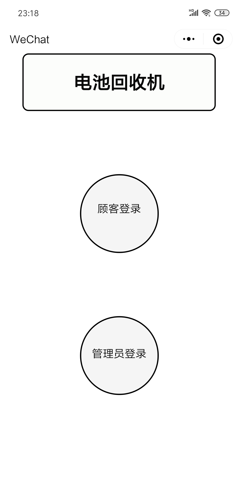
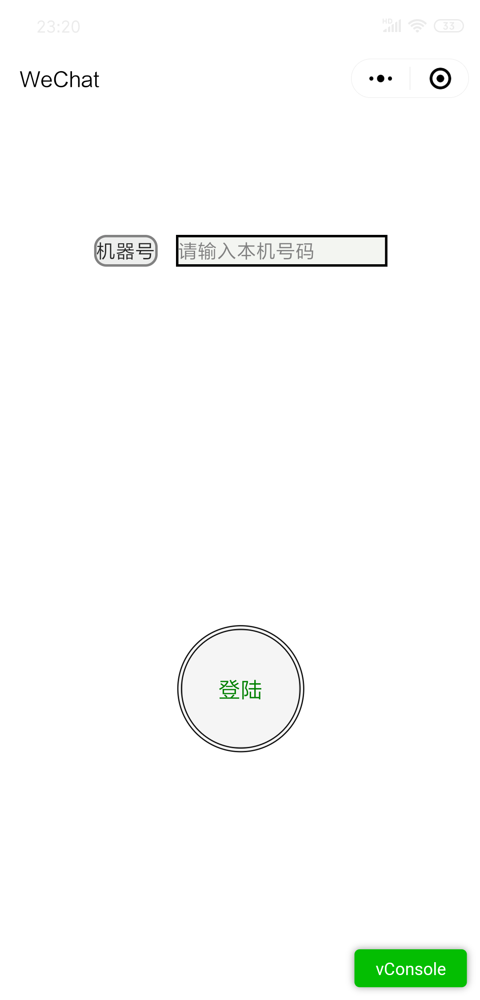
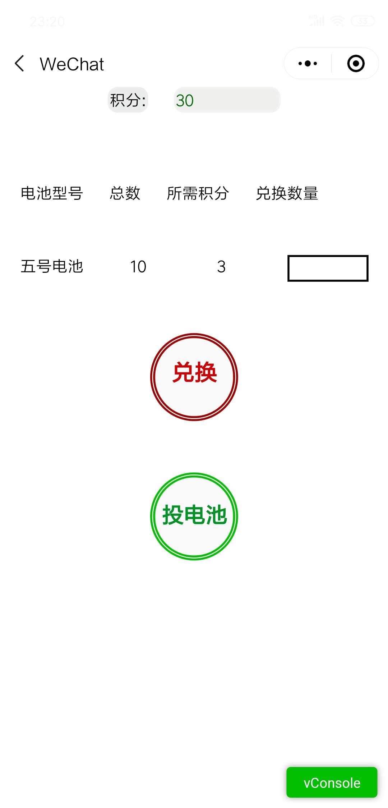
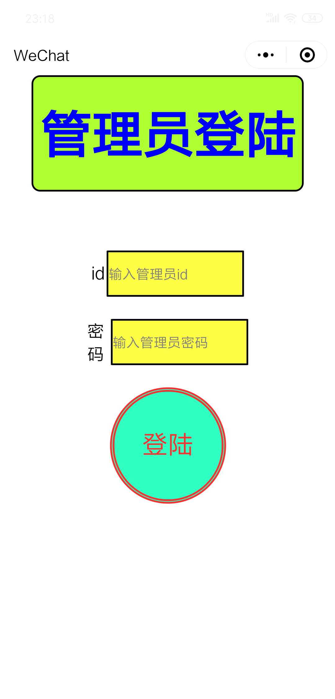
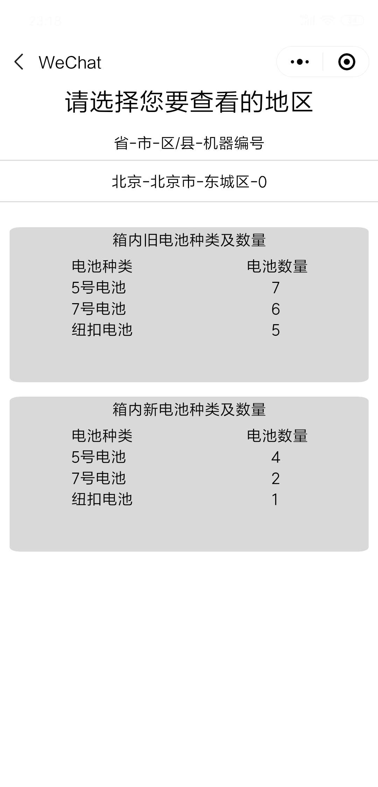

# Wechat Mini Program Development

### Purpose
I develop this mini program to control the battery collector via Internet

### Project Display
> 注意，中国内地如果点击图片后还是无法显示，请科学上网后刷新重试 

- **The First Page**
  1. User and Admin click different buttons to login 
  

---

- **User Login Page**
  1. As a user, firstly, you should type in the ID of the battery collector they want to use.
  2. Then, you should click the round "Login" button, and Wechat will ask you whether this mini program can have your permission 
  to access your location and phone number
  3. To use this mini program, you need to give this permission. 
  

---

- **User Page After Login**
  1. If you click the green round button "push battery", the battery collector you are using will open
   it mouth, and you can throw you battery in. The machine will find out which type of battery you just 
      throwed and give you corresponding credits.
  2. If you click the red round button "Exchange", you can type in the number of V battery you want to 
  exchange for. If the credits is enough for this exchange, those V batteries will be pushed out from
   the battery collector 
  

---

- **Admin Login Page**
  1. Firstly, you should type in your ID and Password.
  2. Then you can click the cyan round button "Login" to log in if your password is correct 
  

---

- **Admin Page After Login**
  1. On the upper side of the page, you can check the status of each battery collector by selecting
   "Province-City-District-ID of Battery Collector"
  2. Then, two boxes below will show you the number of used and new batteries in this battery Collector. 
  
